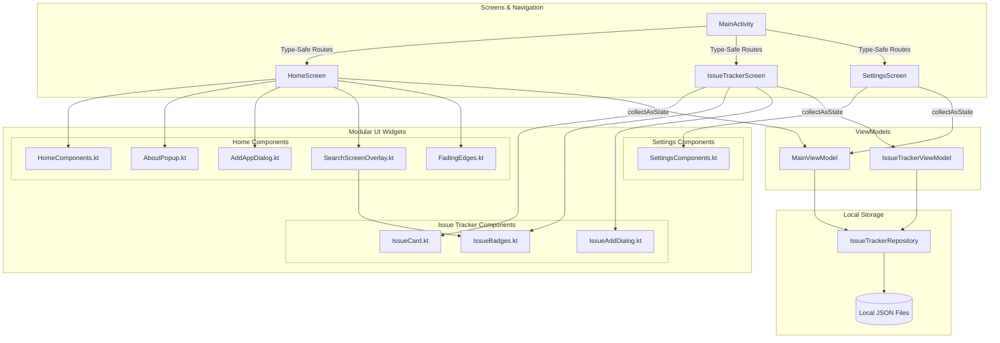
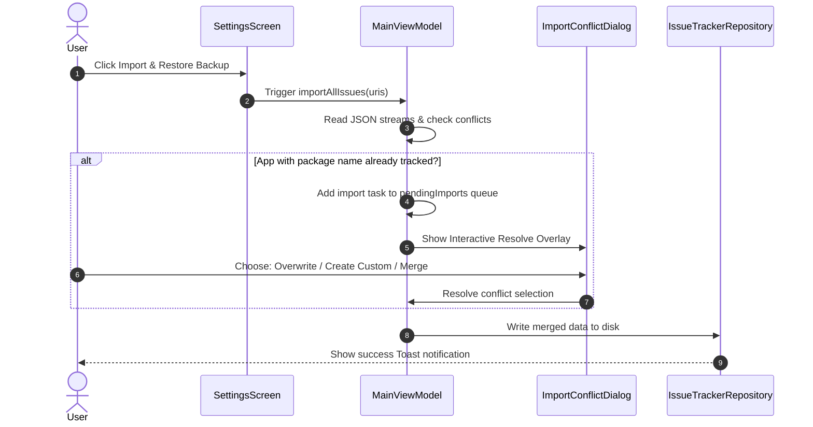

# Issue Tracker Codebase Analysis & Documentation

Welcome to the technical documentation for the Issue Tracker application. This document details the application's architecture, data models, component layout, custom theme system, and local JSON backup engine.

---

## 1. High-Level Architecture Overview

The Issue Tracker is an offline-first Android application designed with modern Jetpack Compose. It follows clean architectural principles by separating concerns into distinct layers:

- **Presentation Layer (Compose UI)**: Screen composables that handle user interaction and UI drawing.
- **State Management Layer (ViewModels)**: Holds and manages application state, exposes Kotlin StateFlows, and communicates with the repository.
- **Data Layer (Repository & Models)**: Handles serialization and reads/writes to local storage using simple JSON files.

### Structural Flow Graph

---

## 2. Presentation Layer & ViewModels

The presentation layer utilizes Jetpack Compose for declarative layouts and unidirectional data flow.

### Navigation (`MainActivity.kt`)
The navigation relies on type-safe routes using Kotlin Serialization:
- `@Serializable object Home`: Route to the Home Screen.
- `@Serializable object Settings`: Route to the Settings Screen.
- `@Serializable data class IssueTracker(val appId: String)`: Route to a specific app's tracker screen, carrying its identifier.

### ViewModels
1. **[MainViewModel](file:///c:/Users/rkhar/Documents/ANDROID%20APPS/IssueTracker/app/src/main/java/com/gratus/appissuetracker/ui/MainViewModel.kt)**:
   - Manages global state including list of tracked apps (`apps`), cached list of installed user apps (`installedApps`), settings properties (theme, scheme details, colors), and the pending JSON import queue.
   - Triggers background recalculations for total and open issue counts.
2. **[IssueTrackerViewModel](file:///c:/Users/rkhar/Documents/ANDROID%20APPS/IssueTracker/app/src/main/java/com/gratus/appissuetracker/ui/IssueTrackerViewModel.kt)**:
   - Manages a single application's issues list (`issues`), search queries (`searchQuery`), and active filters (`filter` of type `IssueFilter`).
   - Automatically migrates legacy issues (migrating default serial numbers from `0` to incremental positive integers).

---

## 3. Data Layer Schema

Persistence is fully local and runs on standard `java.io.File` read/write operations mapping data models to local JSON format in `context.filesDir`.

### `TrackedApp`
Represents an application or project whose issues are tracked. Stored inside `apps.json`.

| Field Name | Type | Description |
| :--- | :--- | :--- |
| `id` | `String` | Unique identifier (equals the package name, or is a generated UUID). |
| `name` | `String` | Human-readable name of the application or project. |
| `packageName` | `String?` | The Android package name. `null` if the app is a custom project. |
| `versionName` | `String` | The version name (e.g. `"1.0.0"`). |
| `isCustom` | `Boolean` | `true` if manually added; `false` if imported from installed user apps. |
| `addedTimestamp` | `Long` | Unix timestamp in milliseconds indicating when the app was tracked. |

### `IssueItem`
Represents a recorded issue, feature request, or idea. Stored inside `issues_<appId>.json`.

| Field Name | Type | Description |
| :--- | :--- | :--- |
| `id` | `String` | Unique identifier (generated UUID). |
| `serialNumber` | `Int` | Readable local counter identifier (e.g., `#1`, `#2`). |
| `title` | `String` | Header summarizing the issue. |
| `description` | `String` | Markdown-styled description details. |
| `category` | `String` | Allowed categories: `"Issue"`, `"Feature"`, or `"Idea"`. |
| `priority` | `Int` | Numeric value (1 = High, 2 = Normal, 3 = Low). |
| `isClosed` | `Boolean` | Indicates whether the issue is resolved/closed. |
| `timestamp` | `Long` | Unix timestamp of creation. |
| `closedTimestamp` | `Long?` | Unix timestamp when marked closed (`null` if open). |
| `comments` | `List<IssueComment>` | Embedded list of comments. |
| `appVersion` | `String?` | The version name of the app at creation time. |

### `IssueComment`
A text note appended to an issue item.

| Field Name | Type | Description |
| :--- | :--- | :--- |
| `text` | `String` | Content body of the comment (supports text styling). |
| `timestamp` | `Long` | Unix timestamp of comment creation. |

---

## 4. Aesthetics & Theme Engine

The visual design leverages custom palettes defined in [Theme.kt](file:///c:/Users/rkhar/Documents/ANDROID%20APPS/IssueTracker/app/src/main/java/com/gratus/appissuetracker/ui/theme/Theme.kt) under `SoftTodoTheme`. It reads the theme mode and scheme from preferences:

- **Theme Modes**: `auto` (system synchronizer), `light`, and `dark`.
- **Color Schemes**:
  - `minimal`: Clean lavender backing with glassmorphic borders and space-blurry spheres.
  - `simple`: Black-and-white base style featuring priority-colored accent borders.
  - `colorful`: Pastel neon theme supporting real-time **Hue Shift** (from `-80f` to `60f`) and **Saturation Scale** (from `0.7f` to `1.3f`) dynamic custom settings.
  - `system`: Native Dynamic Monet Theme fetching wallpaper colors on Android 12+.

---

## 5. Data Backups & Merge Resolution

Issues can be imported or exported locally to `Documents/IssueTrackerBackups` in standard JSON formats.

When importing, conflicts occur if an app with the same package name is already tracked. The application resolves conflicts interactively:
- **Overwrite**: Deletes the existing database record and restores from backup.
- **Create Custom Project**: Imports the backup under a custom UUID, creating a separate repository.
- **Merge**: Keeps both sets of issues, re-indexing their serial numbers.
